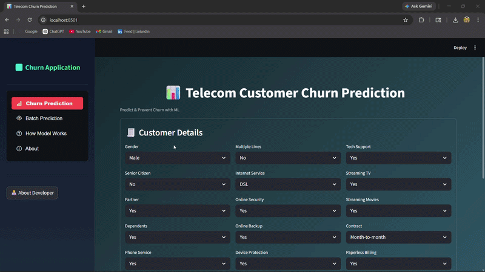

# 🚀 Telecom Customer Churn Prediction System

---

## 📊 Overview
This project is a Machine Learning-based Customer Churn Prediction System designed to identify customers who are likely to leave a telecom service.

The application not only predicts churn but also provides:

- 📈 Risk categorization  
- 💡 Business recommendations  
- 📊 Explainable insights (feature impact)  

It is built as an interactive Streamlit web application for real-world usability.


- **Live Demo:** [Temecom Customer Churn Prediction](https://telecom-customer-churn-prediction-shreyansh.streamlit.app/)

---

## 🎯 Features

- 🔍 **Single Customer Prediction**  
  Enter individual customer details and get churn probability along with risk classification (Low, Medium, High)

- 📂 **Batch Prediction**  
  Upload a CSV file to predict churn for multiple customers at once

- 🎛️ **Interactive Filters**  
  Filter results based on Prediction (Churn / No Churn) and Risk Level (Low / Medium / High)

- 🎨 **Color-Coded Results**  
  Easily identify customer risk levels with visually highlighted rows

- 💡 **Business Recommendations**  
  Get actionable suggestions for customer retention based on risk level

- 📥 **Download Results**  
  Export predictions as CSV or styled Excel file with color formatting

- 🖥️ **User-Friendly Interface**  
  Built using Streamlit for an interactive and intuitive experience

---

## ⚙️ How It Works
1. User inputs customer details or uploads a CSV file for batch prediction  
2. Data preprocessing is applied (encoding, scaling, validation)  
3. The trained model predicts churn probability  
4. Output includes:
   - Churn / No Churn  
   - Risk Level (Low, Medium, High)  
   - Probability score  
5. System provides: 
   - Business recommendations  

---

## 🛠️ Tech Stack
- **Language:** Python  
- **Libraries:** Pandas, NumPy, Scikit-learn, XGBoost
- **Visualization:** Matplotlib, Seaborn  
- **Framework:** Streamlit  
- **Tools:** Git, VS Code, Jupyter Notebook  

---

## 📁 Project Structure
```bash
project/
│
├── app.py
│
├── pages/
│   ├── churn_prediction.py
│   ├── batch_prediction.py
│   ├── about.py
│   ├── about_developer.py
│   ├── model_workflow.py
│
├── utils/
│   ├── load_models.py
│   ├── predict_form.py
│
├── models/
│   ├── churn_pipeline.pkl
│
├── assets/
│   ├── profile.jpg
│   ├── resume.pdf
│   ├── Demo.gif
│
├── Datasets/
│   ├── telecom_churn.csv
│   ├── batch_churn_sample_file.csv
│
├── requirements.txt
│
├── Telecom Customer Churn Prediction.ipynb
│
└── README.md

---

## 🎥 Demo




## ▶️ How to Run Project

### 1️⃣ Clone Repository

```bash
git clone https://github.com/ShreyanshPatel17/Telecom-Customer-Churn-Prediction.git
cd Telecom-Customer-Churn-Prediction
```

### 2️⃣ Install Dependencies

```bash
pip install -r requirements.txt
```

### 3️⃣ Run Application

```bash
streamlit run app.py
```

---

## 📚 Datasets

- **WA_Fn-UseC_-Telco-Customer-Churn.csv**  
  (Source: [Kaggle - Telco Customer Churn](https://www.kaggle.com/blastchar/telco-customer-churn))

---

## 📬 Contact

**Shreyansh Patel**  

- 📧 Email: 17shreyanshpatel@gmail.com  
- 🔗 LinkedIn: https://linkedin.com/in/shreyanshpatel17  

--- 